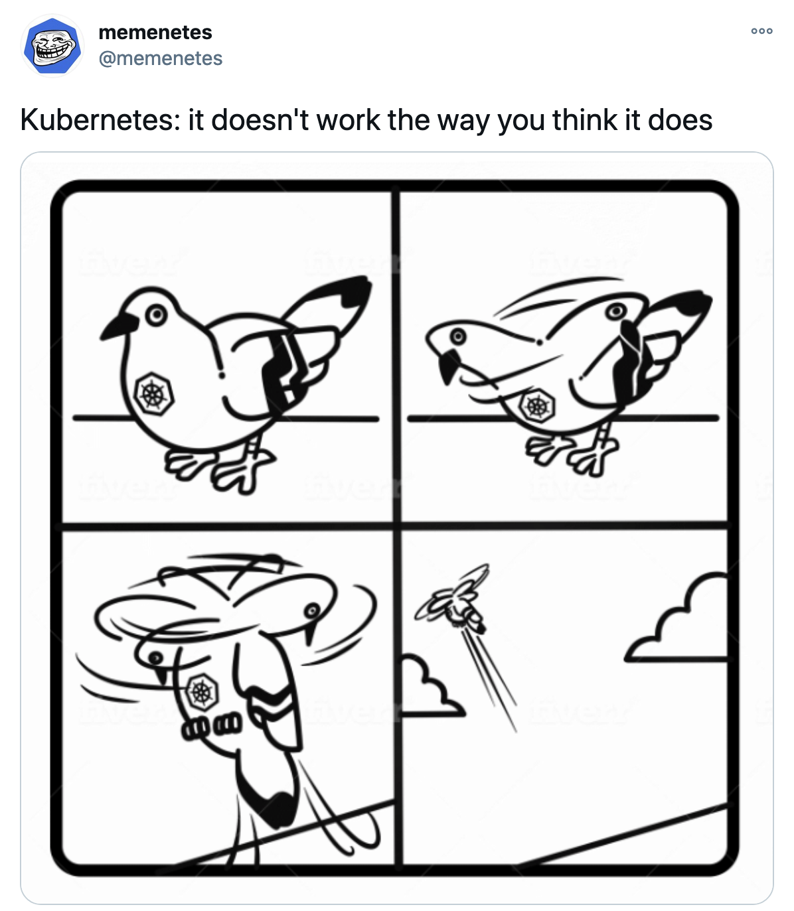

### Running the demo
1. First create a local test cluster. This step requires atleast docker to be installed. This might take time if you're setting up kind for the first time.
```
$ make setup-cluster
```
2. Istio service mesh has been installed and the demo helloworld with versions v1 and v2 have now been setup.
3. Setup traffic split and an auxillary nginx container.
```
$ make setup-traffic-split
```
4. Execute requests to helloworld and see traffic split 80-20 between v1-v2 respectively
```
$ make execute-requests
```
5. Cleanup local environment
```
$ make clean
```

The above scenario uses the simple way of installing istio and configuring a traffic split  
by applying `VirtualService` and `DestinationRule` through kubectl.

---

We will now explore the controller way of doing things.

### Controller demo
1. Local cluster creation step remains the same
```shell
$ make setup-cluster
```
2. Generate the required CRDs and install in the cluster
```shell
$ make generate
$ make install
```
3. The cluster now indentifies what a gojek workload means. Description can have more detail once we mature our CRD further, since this is a POC, I'm not bothering with that.
```shell
$ kubectl explain workload
KIND:     Workload
VERSION:  labs.ishankhare.dev/v1alpha1

DESCRIPTION:
     <empty>
```
4. One can find the sample workload yaml manifest in `config/samples/labs_v1alpha1_workload.yaml`. Looks something like this. It's not refined, can be made even better.
```yaml
apiVersion: labs.ishankhare.dev/v1alpha1
kind: Workload
metadata:
  name: workload-sample
spec:
  host: helloworld
  targets:
    - name: helloworld-v1
      namespace: default
      trafficSplit:
        hosts:
          - helloworld
        subsetName: v1
        destinationHost: helloworld
        subsetLabels:
          version: v1
        weight: 80
    - name: helloworld-v2
      namespace: default
      trafficSplit:
        hosts:
          - helloworld
        subsetName: v2
        destinationHost: helloworld
        subsetLabels:
          version: v2
        weight: 20
```
5. Now begins the magic, we are going to apply this sample workload, and the controller should create the traffic split
	for us by automatically creating the right `VirtualService` and `DestinationRule`. In one terminal, we'll 
	start out controller (locally, remember this is for testing, the final thing would run inside the cluster itself).
	```shell
	$ make run
	2021-01-25T01:52:41.928+0530    INFO    setup   starting manager
	2021-01-25T01:52:41.928+0530    INFO    controller-runtime.manager      starting metrics server {"path": "/metrics"}
	2021-01-25T01:52:41.928+0530    INFO    controller-runtime.manager.controller.workload  Starting EventSource    {"reconciler group": "labs.ishankhare.dev", "reconciler kind": "Workload", "source": "kind source: /, Kind="}
	2021-01-25T01:52:42.029+0530    INFO    controller-runtime.manager.controller.workload  Starting EventSource    {"reconciler group": "labs.ishankhare.dev", "reconciler kind": "Workload", "source": "kind source: /, Kind="}
	2021-01-25T01:52:42.129+0530    INFO    controller-runtime.manager.controller.workload  Starting EventSource    {"reconciler group": "labs.ishankhare.dev", "reconciler kind": "Workload", "source": "kind source: /, Kind="}
	2021-01-25T01:52:42.231+0530    INFO    controller-runtime.manager.controller.workload  Starting Controller     {"reconciler group": "labs.ishankhare.dev", "reconciler kind": "Workload"}
	2021-01-25T01:52:42.231+0530    INFO    controller-runtime.manager.controller.workload  Starting workers        {"reconciler group": "labs.ishankhare.dev", "reconciler kind": "Workload", "worker count": 1}
	```
6. In another terminal, let's apply our workload CRD
```shell
$ kubectl apply -f config/samples/labs_v1alpha1_workload.yaml
workload.labs.ishankhare.dev/workload-sample created
```
7. As soon as the above command is executes, the controller starts its magic, visible in controller logs
```shell
2021-01-25T01:54:09.088+0530    INFO    controllers.Workload    ====== Reconciling Workload =======     {"workload": "default/workload-sample"}
2021-01-25T01:54:09.088+0530    INFO    controllers.Workload    Workload created for following targets. {"workload": "default/workload-sample"}
2021-01-25T01:54:09.088+0530    INFO    controllers.Workload    target  {"workload": "default/workload-sample", "name": "helloworld-v1", "namespace": "default", "hosts": "[helloworld]"}
2021-01-25T01:54:09.088+0530    INFO    controllers.Workload    subset  {"workload": "default/workload-sample", "subset name": "v1", "subset labels": "map[version:v1]", "weight": 80}
2021-01-25T01:54:09.088+0530    INFO    controllers.Workload    target  {"workload": "default/workload-sample", "name": "helloworld-v2", "namespace": "default", "hosts": "[helloworld]"}
2021-01-25T01:54:09.088+0530    INFO    controllers.Workload    subset  {"workload": "default/workload-sample", "subset name": "v2", "subset labels": "map[version:v2]", "weight": 20}
2021-01-25T01:54:09.088+0530    INFO    controllers.Workload    Virtual Service {"workload": "default/workload-sample", "PHASE:": "PENDING"}
2021-01-25T01:54:09.088+0530    INFO    controllers.Workload    Transitioning state to create Vritual Service   {"workload": "default/workload-sample"}
2021-01-25T01:54:09.088+0530    INFO    controllers.Workload    Destination Rule        {"workload": "default/workload-sample", "PHASE:": "PENDING"}
2021-01-25T01:54:09.088+0530    INFO    controllers.Workload    Transitioning state to create Destination Rule  {"workload": "default/workload-sample"}
2021-01-25T01:54:09.099+0530    INFO    controllers.Workload    ====== Reconciling Workload =======     {"workload": "default/workload-sample"}
2021-01-25T01:54:09.099+0530    INFO    controllers.Workload    Workload created for following targets. {"workload": "default/workload-sample"}
2021-01-25T01:54:09.099+0530    INFO    controllers.Workload    target  {"workload": "default/workload-sample", "name": "helloworld-v1", "namespace": "default", "hosts": "[helloworld]"}
2021-01-25T01:54:09.099+0530    INFO    controllers.Workload    subset  {"workload": "default/workload-sample", "subset name": "v1", "subset labels": "map[version:v1]", "weight": 80}
2021-01-25T01:54:09.099+0530    INFO    controllers.Workload    target  {"workload": "default/workload-sample", "name": "helloworld-v2", "namespace": "default", "hosts": "[helloworld]"}
2021-01-25T01:54:09.099+0530    INFO    controllers.Workload    subset  {"workload": "default/workload-sample", "subset name": "v2", "subset labels": "map[version:v2]", "weight": 20}
2021-01-25T01:54:09.099+0530    INFO    controllers.Workload    Virtual Service {"workload": "default/workload-sample", "PHASE:": "CREATED"}
2021-01-25T01:54:09.099+0530    INFO    controllers.Workload    virtual service not found but should exist      {"workload": "default/workload-sample", "lookup key": {"namespace": "default", "name": "helloworld"}}
2021-01-25T01:54:09.099+0530    INFO    controllers.Workload    VirtualService.networking.istio.io "helloworld" not found     {"workload": "default/workload-sample"}
2021-01-25T01:54:09.123+0530    INFO    controllers.Workload    Successfully created virtual service    {"workload": "default/workload-sample"}
2021-01-25T01:54:09.123+0530    INFO    controllers.Workload    Destination Rule        {"workload": "default/workload-sample", "PHASE:": "CREATED"}
2021-01-25T01:54:09.123+0530    INFO    controllers.Workload    destination rule not found but should exist     {"workload": "default/workload-sample", "req key": {"namespace": "default", "name": "helloworld"}}
2021-01-25T01:54:09.123+0530    INFO    controllers.Workload    DestinationRule.networking.istio.io "helloworld" not found    {"workload": "default/workload-sample"}
2021-01-25T01:54:09.143+0530    INFO    controllers.Workload    Successfully created Destination Rule   {"workload": "default/workload-sample"}
2021-01-25T01:54:09.162+0530    INFO    controllers.Workload    ====== Reconciling Workload =======     {"workload": "default/workload-sample"}
2021-01-25T01:54:09.162+0530    INFO    controllers.Workload    Workload created for following targets. {"workload": "default/workload-sample"}
```
8. We can see the `VirtualService` and `DestinationRule` created by the controller for us
```shell
$ kubectl get vs,dr
NAME                                            GATEWAYS   HOSTS          AGE
virtualservice.networking.istio.io/helloworld              [helloworld]   3m30s

NAME                                             HOST         AGE
destinationrule.networking.istio.io/helloworld   helloworld   3m30s
```
9. We can check the traffic split is working fine for us on not. Its currently set to 80:20.
```shell
$ make execute-requests
kubectl exec -it nginx -- bash -c  "for x in {1..10};do curl helloworld:5000/hello; done"
Defaulting container name to nginx.
Use 'kubectl describe pod/nginx -n default' to see all of the containers in this pod.
Hello version: v1, instance: helloworld-v1-5b75657f75-jtpxq
Hello version: v1, instance: helloworld-v1-5b75657f75-jtpxq
Hello version: v1, instance: helloworld-v1-5b75657f75-jtpxq
Hello version: v1, instance: helloworld-v1-5b75657f75-jtpxq
Hello version: v1, instance: helloworld-v1-5b75657f75-jtpxq
Hello version: v1, instance: helloworld-v1-5b75657f75-jtpxq
Hello version: v1, instance: helloworld-v1-5b75657f75-jtpxq
Hello version: v1, instance: helloworld-v1-5b75657f75-jtpxq
Hello version: v2, instance: helloworld-v2-7855866d4f-r4dc8
Hello version: v2, instance: helloworld-v2-7855866d4f-r4dc8
```

#### What is not supported yet?
The updation logic - where you update the split percentage in the workload CRD and the controller updates the
corresponding `VirtualService` and `DestinationRule` fields is not implemented yet - but that's not something
difficult to achieve.

#### Is that it?
One more trick left to showcase. If you were to go and delete either the `VirtualService` or the `DestinationRule` now,
since the controller is watching over them, it will instantly recreate it with the correct configuration. This simulates
an actual human error which have triggered alerts for the team in the past only to realise that somewhere,
somebody did a `kubectl delete vs helloworld`. Go ahead, try it. Then try to run `kubectl get vs,dr` again.

If this feels counter-intutive, I can understand. Thats how most things are in kubernetes when you dive deeper.
Hence I'll just leave this here - https://twitter.com/memenetes/status/1250167086711803904

